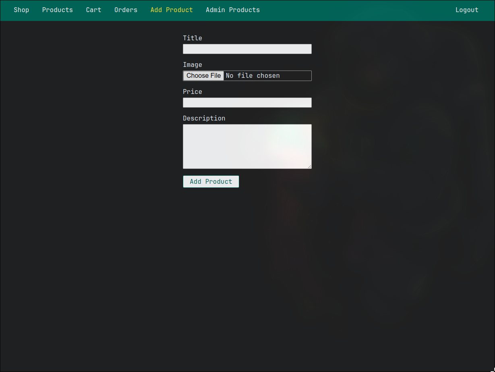

# Shop Project

This is a Node.js project that uses EJS as the templating engine and MongoDB as the database. The project implements a simple shop application that allows users to view, add, edit, and delete products.

## Screenshots

### Home Page

### Product Details

### Adding Products

### Cart

### Orders

## Contributing

Contributions are welcome! If you find any bugs or have suggestions for new features, please create an issue on GitHub.